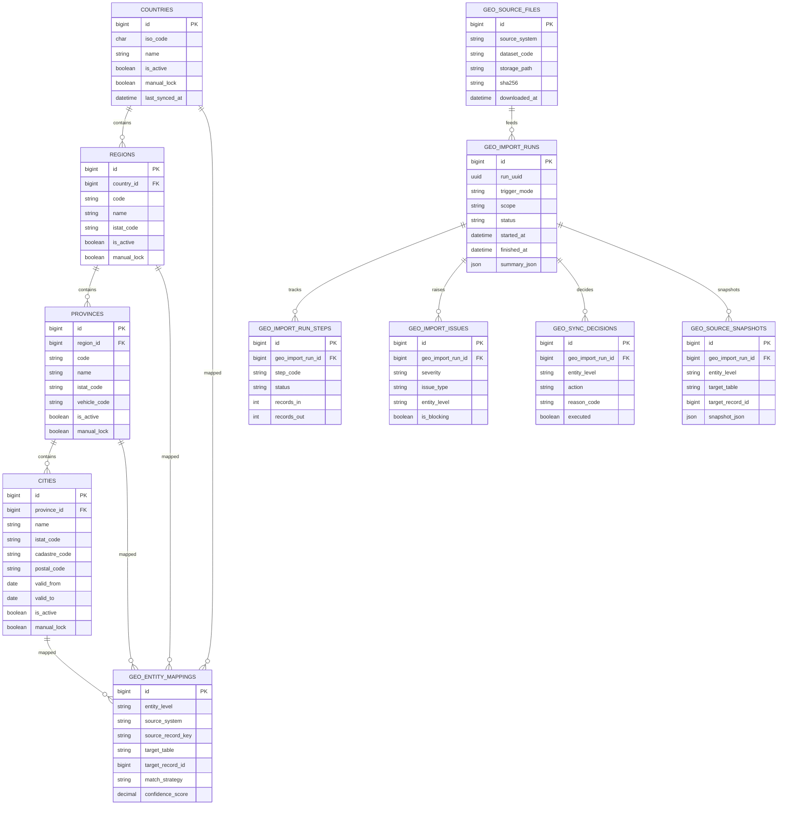

# FamilyHub · Geografia sorgente, sincronizzazione e quality control

Data: 2026-06-21

## 1. Obiettivo

Definire un modello robusto per:

- popolare `countries`, `regions`, `provinces`, `cities`
- mantenere il dato aggiornato nel tempo
- tracciare ogni importazione
- intercettare anomalie prima che impattino le anagrafiche operative
- mantenere separati il dato sorgente, il dato canonico applicativo e gli esiti di qualità

## 2. Fonti dati raccomandate

### Italia

Fonti primarie:

- ANPR tabelle di decodifica
- ANPR archivio storico dei comuni
- ISTAT elenco comuni italiani

Uso previsto:

- ANPR come riferimento di interoperabilità
- ISTAT come base strutturale e di codifica amministrativa
- archivio storico ANPR per fusioni, soppressioni, rinominazioni e cessazioni

### Estero

Fonte primaria:

- GeoNames

Uso previsto:

- popolamento iniziale nazioni
- eventuale supporto successivo per suddivisioni amministrative estere

## 3. Principio architetturale

Il processo geografico viene diviso in 4 strati:

1. acquisizione file sorgente
2. staging raw normalizzato per sorgente
3. validazione e qualità
4. pubblicazione nel modello canonico applicativo

Il batch:

- non scrive direttamente nei master data senza controlli
- non distrugge dati esistenti senza audit
- non sovrascrive manualità applicative senza una regola esplicita

## 4. Strati dati

### 4.1 Storage file sorgente

I file scaricati vengono archiviati in bucket privato o storage locale applicativo:

- `geography-sources/anpr/...`
- `geography-sources/istat/...`
- `geography-sources/geonames/...`

Metadati minimi da registrare:

- nome file
- URL sorgente
- checksum SHA-256
- data download
- dimensione
- content type

### 4.2 Tabelle raw di staging

Tabelle proposte:

- `geo_source_files`
- `geo_source_countries_raw`
- `geo_source_regions_raw`
- `geo_source_provinces_raw`
- `geo_source_cities_raw`
- `geo_source_city_history_raw`

Scopo:

- conservare il dato sorgente quasi “as-is”
- separare le diverse sorgenti
- permettere reprocessing senza riscaricare il file

### 4.3 Tabelle canoniche applicative

Restano il riferimento per tutto il software:

- `countries`
- `regions`
- `provinces`
- `cities`

Queste tabelle devono essere usate da:

- anagrafiche strutture
- anagrafiche minori
- anagrafiche contatti
- reportistica applicativa

### 4.4 Tabelle qualità e audit

Tabelle proposte:

- `geo_import_runs`
- `geo_import_run_steps`
- `geo_import_issues`
- `geo_entity_mappings`
- `geo_sync_decisions`
- `geo_source_snapshots`

## 5. Modello dati proposto

### `geo_source_files`

Una riga per ogni file acquisito.

Campi:

- `id`
- `source_system` (`anpr`, `istat`, `geonames`)
- `source_domain`
- `dataset_code`
- `dataset_name`
- `dataset_version` nullable
- `source_url`
- `storage_disk`
- `storage_path`
- `file_name`
- `mime_type`
- `file_size_bytes`
- `sha256`
- `downloaded_at`
- `published_at` nullable
- `is_active`
- `created_at`
- `updated_at`

Vincoli:

- unique `source_system + dataset_code + sha256`

### `geo_import_runs`

Una riga per ogni esecuzione batch.

Campi:

- `id`
- `run_uuid`
- `trigger_mode` (`manual`, `scheduled`, `bootstrap`)
- `scope` (`full`, `countries_only`, `italy_admin`, `history_only`)
- `status` (`queued`, `running`, `completed`, `completed_with_warnings`, `failed`, `rolled_back`)
- `started_at`
- `finished_at` nullable
- `source_file_count`
- `raw_record_count`
- `normalized_record_count`
- `published_record_count`
- `issue_count`
- `error_count`
- `summary_json`
- `initiated_by_user_id` nullable
- `created_at`
- `updated_at`

### `geo_import_run_steps`

Dettaglio step per run.

Campi:

- `id`
- `geo_import_run_id`
- `step_code` (`download`, `parse`, `normalize`, `validate`, `diff`, `publish`, `report`)
- `status`
- `started_at`
- `finished_at` nullable
- `records_in`
- `records_out`
- `message` nullable
- `metrics_json` nullable
- `created_at`
- `updated_at`

### `geo_import_issues`

Registro anomalie funzionali o qualità.

Campi:

- `id`
- `geo_import_run_id`
- `severity` (`info`, `warning`, `error`, `critical`)
- `issue_type`
- `entity_level` (`country`, `region`, `province`, `city`, `history`, `file`)
- `source_system`
- `source_record_key` nullable
- `target_table` nullable
- `target_record_id` nullable
- `message`
- `details_json` nullable
- `is_blocking`
- `resolved_at` nullable
- `resolution_notes` nullable
- `created_at`
- `updated_at`

### `geo_entity_mappings`

Mappatura tra identità sorgente e identità canonica interna.

Campi:

- `id`
- `entity_level`
- `source_system`
- `source_record_key`
- `source_parent_key` nullable
- `target_table`
- `target_record_id`
- `match_strategy` (`code_exact`, `name_exact`, `manual_override`, `history_link`)
- `confidence_score`
- `is_manual_override`
- `created_at`
- `updated_at`

Vincoli:

- unique `entity_level + source_system + source_record_key`

### `geo_sync_decisions`

Traccia le decisioni prese durante il diff/publish.

Campi:

- `id`
- `geo_import_run_id`
- `entity_level`
- `action` (`create`, `update`, `deactivate`, `skip`, `manual_review`)
- `target_table`
- `target_record_id` nullable
- `source_system`
- `source_record_key`
- `before_json` nullable
- `after_json` nullable
- `reason_code`
- `executed`
- `created_at`
- `updated_at`

### `geo_source_snapshots`

Snapshot append-only del dato pubblicato a ogni run.

Campi:

- `id`
- `geo_import_run_id`
- `entity_level`
- `target_table`
- `target_record_id`
- `snapshot_json`
- `created_at`

## 6. Evoluzione delle tabelle canoniche geografiche

Per supportare sincronizzazione e qualità, conviene estendere:

### `countries`

Nuovi campi consigliati:

- `source_system` nullable
- `source_record_key` nullable
- `is_active`
- `last_synced_at` nullable
- `manual_lock` default false

### `regions`

Nuovi campi consigliati:

- `source_system` nullable
- `source_record_key` nullable
- `istat_code` nullable
- `is_active`
- `last_synced_at` nullable
- `manual_lock`

### `provinces`

Nuovi campi consigliati:

- `source_system` nullable
- `source_record_key` nullable
- `istat_code` nullable
- `vehicle_code` nullable
- `is_active`
- `last_synced_at` nullable
- `manual_lock`

### `cities`

Nuovi campi consigliati:

- `source_system` nullable
- `source_record_key` nullable
- `istat_code` nullable
- `is_active`
- `valid_from` nullable
- `valid_to` nullable
- `last_synced_at` nullable
- `manual_lock`

Nota:

- `manual_lock = true` impedisce al batch di modificare automaticamente il record senza decisione esplicita

## 7. Regole di qualità

Controlli minimi obbligatori:

- assenza duplicati per chiavi di business
- ogni regione deve avere una nazione valida
- ogni provincia deve avere una regione valida
- ogni città deve avere una provincia valida
- `iso_code` nazione lungo 2 caratteri
- codici regionali/provinciali valorizzati dove obbligatori
- `cadastre_code` coerente come formato se presente
- `postal_code` coerente come formato se presente
- nessun record orfano
- nessun record storico che cancella retroattivamente riferimenti esistenti

Controlli avanzati consigliati:

- rename detection tra comuni simili
- rilevazione fusioni/soppressioni
- confronto tra ISTAT e ANPR sugli stessi codici
- controllo variazioni numeriche inattese
- soglia massima di delta per singolo run

## 8. Regole di pubblicazione

### Create

Consentito quando:

- esiste mapping univoco
- il record è nuovo
- nessun controllo blocking fallisce

### Update

Consentito quando:

- il record non è `manual_lock`
- il diff è solo su campi ammessi
- non esistono ambiguità di identity matching

### Deactivate

Consentito quando:

- la fonte segnala cessazione o soppressione
- esiste tracciamento storico
- non si rompe integrità referenziale operativa

Non si deve fare hard delete sui master data già referenziati.

## 9. Batch giornaliero raccomandato

Frequenza:

- verifica giornaliera notturna

Modalità:

1. scarica solo i dataset configurati
2. calcola hash
3. se hash invariato, marca dataset come `unchanged`
4. se hash cambiato, importa in raw
5. esegue validazione e diff
6. applica solo modifiche sicure
7. produce report e issue list

## 10. Strategia iniziale raccomandata

### Fase 1

- nazioni da GeoNames
- Italia da seed controllato/manuale
- no auto-update in produzione
- solo report differenze

### Fase 2

- ingestione ANPR/ISTAT
- diff automatico
- publish controllato

### Fase 3

- gestione archivio storico comuni
- riconciliazione fusioni e soppressioni
- quality dashboard

## 11. Benefici

- dato più affidabile
- aggiornamenti tracciati
- riduzione del rischio di rottura anagrafiche
- sicurezza operativa su dati sensibili che dipendono dalla geografia
- base solida per audit, report e manutenzione futura

## 12. Schema E/R sintetico

