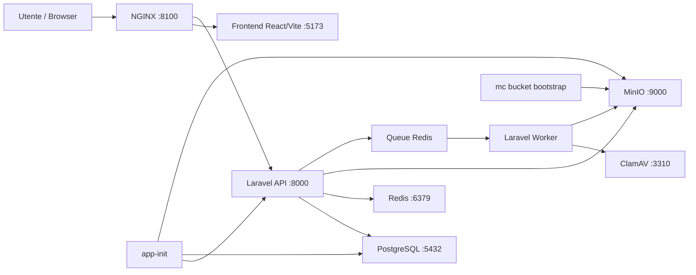
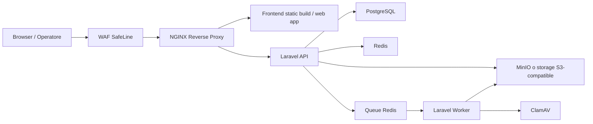
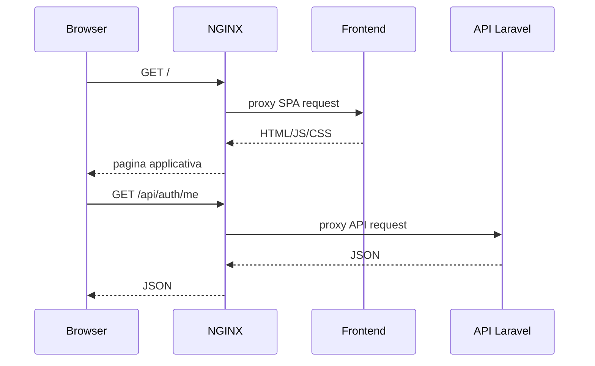
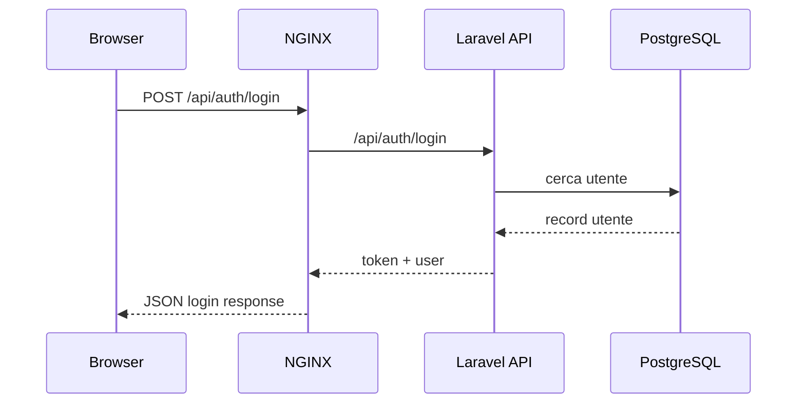
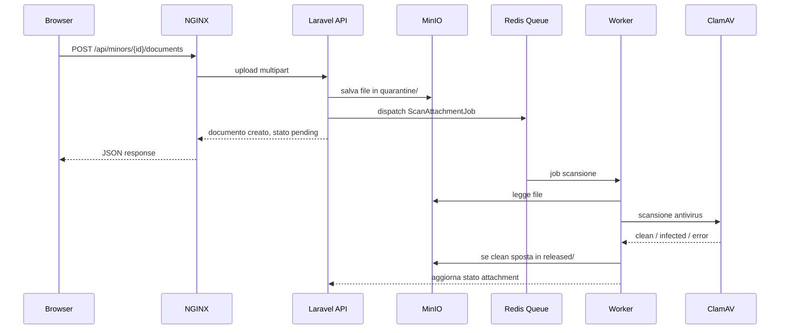

# FamilyHub · Infrastruttura e flussi runtime

## Scopo

Questo documento descrive:

- come è composto lo stack locale Docker
- come passano le richieste tra browser, WAF, NGINX, frontend e API
- come funzionano autenticazione, lookup, CRUD minori e documenti
- come deve essere letta l'architettura in vista della produzione

È pensato per:

- backend team
- UX/frontend team
- DevOps/infrastructure team

## 1. Componenti applicativi

### Edge / accesso

- `SafeLine` come WAF opzionale locale e raccomandato in produzione
- `NGINX` come reverse proxy applicativo

### Runtime applicativo

- `frontend` React/Vite
- `app` Laravel API
- `worker` Laravel queue worker
- `app-init` bootstrap iniziale una tantum

### Dati e servizi interni

- `postgres` database relazionale
- `redis` cache/session/queue broker
- `minio` object storage S3-compatible
- `mc` bootstrap bucket MinIO
- `clamav` scansione antivirus documenti

## 2. Porte e visibilità rete

### Esposizione locale

- `http://localhost:8100` → ingresso principale via `nginx`
- `http://localhost:9000` → API MinIO
- `http://localhost:9001` → console MinIO
- `80/443` → SafeLine solo se profilo `edge` attivo

### Servizi non esposti direttamente all'utente

- `app:8000`
- `frontend:5173`
- `postgres:5432`
- `redis:6379`
- `clamav:3310`

### Reti Docker

- `edge_net` → livello edge/WAF/reverse proxy
- `app_net` → frontend + backend + nginx
- `data_net` → database, redis, object storage, antivirus

`data_net` è interna: i servizi dati non devono essere raggiunti direttamente dall'esterno.

## 3. Routing HTTP attuale

## 3.1 Regola NGINX

### Path `/`

- instradato a `frontend:5173`

### Path `/api/`

- instradato a `app:8000`

## 3.2 Significato pratico

Quando l’utente apre:

- `http://localhost:8100`

vede la SPA frontend.

Quando il frontend chiama:

- `http://localhost:8100/api/...`

la richiesta passa da NGINX e arriva a Laravel.

## 4. Diagramma architetturale · locale

## 5. Diagramma architetturale · produzione raccomandata

## 6. Sequenza richiesta web standard

## 7. Flusso autenticazione

### Passi

1. frontend invia `POST /api/auth/login`
2. NGINX inoltra a Laravel
3. Laravel valida credenziali
4. se MFA è attiva e confermata:
   - richiede `otp`
5. se login valido:
   - genera token Sanctum
   - restituisce profilo utente essenziale
6. frontend usa il token per chiamate successive

## 7.1 Sequenza login

## 8. Flusso caricamento anagrafiche frontend

Le pagine frontend non devono inventare dati statici: devono usare le lookup API.

### Esempi

- geografia → `GET /api/lookups/geography`
- ruoli → `GET /api/lookups/roles`
- stati minore → `GET /api/lookups/minor-statuses`
- generi → `GET /api/lookups/gender-identities`
- tipi contatto → `GET /api/lookups/contact-types`
- tipi documento → `GET /api/lookups/document-types`
- classificazioni documento → `GET /api/lookups/document-classifications`

## 9. Flusso minori

### Elenco minori

1. browser apre pagina `Minori`
2. frontend chiama `GET /api/minors`
3. backend restituisce elenco minori con relazioni principali
4. frontend mostra tabella e filtri

### Dettaglio minore

1. browser apre dettaglio
2. frontend chiama `GET /api/minors/{id}`
3. backend restituisce:
   - anagrafica
   - profilo
   - contatti
   - documenti
4. per storico:
   - frontend chiama anche `GET /api/minors/{id}/history`

## 10. Flusso documenti con sicurezza by default

### Regola chiave

Un documento caricato **non è immediatamente scaricabile**.

### Stato iniziale

- file salvato in area di quarantena
- record attachment con `security_status = pending`

### Sequenza upload documento

### Download documento

Il download è consentito solo se:

- utente ha `attachments.read`
- classificazione documento è compatibile
- `attachment.security_status = clean`

Se il file è ancora `pending` o bloccato:

- backend restituisce `423`

## 11. Ruolo del worker

Il `worker` non serve solo “in futuro”: è già parte essenziale del disegno.

Serve per:

- scansione antivirus documenti
- job asincroni presenti o futuri
- separazione tra richiesta utente e lavorazioni pesanti

## 12. Ruolo di Redis

Redis oggi svolge tre ruoli:

- cache applicativa
- session storage
- queue backend

Questa tripla funzione va considerata anche in produzione.

## 13. Ruolo di MinIO

MinIO è lo storage documentale applicativo.

Contiene:

- documenti sensibili
- bucket privato
- path logici con quarantena e released

Uso attuale:

- locale Docker

Uso produzione:

- può restare MinIO self-hosted
- oppure essere sostituito da storage S3-compatible gestito

L’applicazione non deve dipendere da feature “solo MinIO”: deve restare compatibile con storage S3-compatible.

## 14. Ruolo di ClamAV

ClamAV è il motore antivirus interno per il controllo documentale.

### Posizionamento

- non è esposto al browser
- è raggiunto da `worker` su rete dati interna

### Obiettivo

- bloccare il rilascio di file malevoli o non verificati

## 15. Produzione con WAF davanti

## 15.1 Posizionamento raccomandato

Ordine consigliato:

1. Internet / browser
2. `SafeLine WAF`
3. `NGINX reverse proxy`
4. `frontend` e `Laravel API`
5. servizi dati interni

## 15.2 Cosa deve fare il WAF

- terminazione o ispezione traffico HTTP/HTTPS
- protezione base OWASP Top 10
- rate limiting / bot filtering se disponibile
- protezione upload e path sensibili
- logging eventi di sicurezza

## 15.3 Cosa non deve fare il WAF

- non sostituisce autorizzazioni applicative
- non sostituisce controlli ruolo/classificazione documento
- non sostituisce antivirus documentale

## 16. Produzione · varianti di deploy

## 16.1 Variante A · tutto containerizzato

- WAF
- NGINX
- frontend
- app
- worker
- postgres
- redis
- minio
- clamav

### Pro

- coerenza ambienti
- portabilità alta
- deploy ripetibile

### Contro

- più responsabilità operative sul server

## 16.2 Variante B · app container, dati gestiti

- WAF
- NGINX
- frontend
- app
- worker
- database gestito
- redis gestito
- object storage gestito
- antivirus self-hosted o servizio dedicato

### Pro

- manutenzione dati semplificata
- backup e HA più facili

### Contro

- dipendenza da servizi esterni/managed

## 17. Comportamento locale vs produzione

## 17.1 Locale

- frontend in dev server Vite
- API via Laravel serve
- NGINX come ingresso unificato
- MinIO e ClamAV locali
- SafeLine opzionale con profilo `edge`

## 17.2 Produzione

Raccomandato:

- frontend buildato staticamente
- backend Laravel dietro PHP-FPM o runtime stabile equivalente
- reverse proxy NGINX
- WAF davanti
- servizi dati separati e persistenti

## 18. Rischio principale da chiarire al team UX

Il frontend **non deve**:

- chiamare direttamente `frontend:5173`
- chiamare direttamente `app:8000`
- chiamare direttamente MinIO
- assumere che un upload documento sia subito scaricabile

Il frontend deve sempre passare tramite:

- host pubblico applicativo
- path `/api/...` per il backend

## 19. Rischio principale da chiarire al team sviluppo

I test automatici non devono mai colpire il database runtime.

Serve separare:

- runtime app
- runner test
- database test

Questo è un tema infrastrutturale, non solo applicativo.

## 20. Checklist operativa team UX / team dev

- [ ] chiaro che `/` va al frontend
- [ ] chiaro che `/api/` va a Laravel
- [ ] chiaro che MinIO non è endpoint browser per i documenti protetti
- [ ] chiaro che il download documenti passa sempre dall’API
- [ ] chiaro che il worker è obbligatorio per la pipeline documentale
- [ ] chiaro che in produzione il WAF deve stare davanti a NGINX
- [ ] chiaro che i servizi dati devono stare su rete interna

