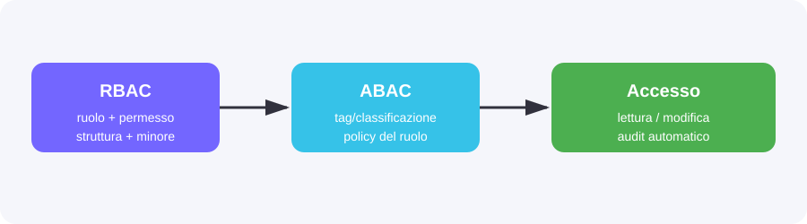
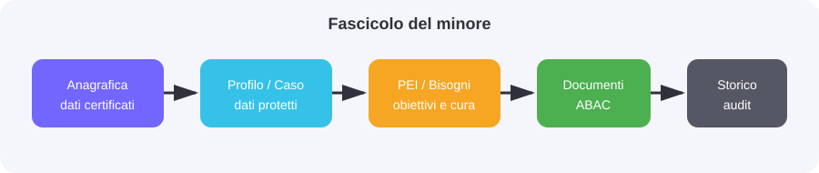
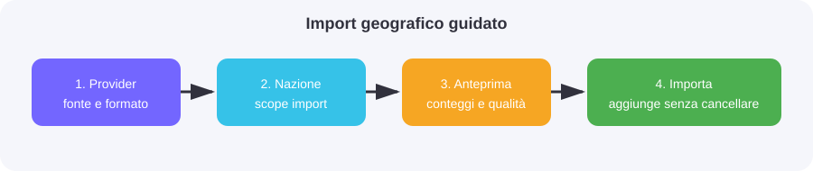

# FamilyHub — Manuale operativo

**Edizione:** 1.5.2 · **Destinatari:** operatori, educatori, coordinatori, amministratori

## Come usare questo manuale

FamilyHub protegge le informazioni del minore con due controlli distinti:

- **Accesso al sistema e al minore:** ruolo, permessi RBAC, struttura e assegnazione puntuale.
- **Accesso al contenuto:** classificazione del documento o della nota e policy ABAC. Il sistema nega per impostazione predefinita.

Se una voce non è visibile o un pulsante restituisce “Permesso insufficiente”, non duplicare dati e non modificare il database: verificare ruolo, struttura, assegnazione al minore e classificazione del contenuto.

## 1. Accesso e sicurezza

### Login e MFA

1. Inserire email e password.
2. Se richiesto, inserire il codice OTP dell’app autenticatrice.
3. Dopo l’accesso verificare nome utente e struttura nella fascia superiore.
4. Per configurare MFA aprire **Profilo → Sicurezza MFA**, non la pagina di login.

La sessione scade dopo 60 minuti di inattività e comunque entro 8 ore. La richiesta di login iniziata da oltre 10 minuti non è più valida. Non condividere password, codici OTP o codici di recupero.

### Ruoli, permessi e assegnazioni

Il ruolo abilita le funzioni generali. L’assegnazione a una struttura e al singolo minore restringe ulteriormente l’accesso. Un amministratore può configurare ruoli e permessi; un coordinatore opera sui minori e sulle strutture consentite dal proprio ruolo.

## 2. Dashboard

La dashboard è il punto di ingresso. Mostra collegamenti alle funzioni, avvisi operativi, scadenze e indicatori disponibili per il profilo. I riquadri non sostituiscono le schede ufficiali: aprire sempre il record per verificare il dettaglio.

## 3. Minori

**Percorsi:** `/minori`, `/minori/nuovo`, `/minori/{id}`.

### Elenco

Usare ricerca e filtri per trovare un minore. **Nuovo minore** apre la scheda di inserimento. **Visualizza** apre il fascicolo; **Modifica** è disponibile solo con il permesso di scrittura.

### Campi anagrafici

| Campo | Cosa inserire | Perché serve |
|---|---|---|
| Codice minore | Identificativo interno univoco | Riconoscere il fascicolo senza affidarsi al nome |
| Nome, cognome, pseudonimo | Dati ufficiali; pseudonimo solo dove previsto | Distinguere uso operativo e minimizzazione nei log |
| Data di nascita | Data certa | Età, scadenze e documenti |
| Sesso/genere | Selezionare l’anagrafica disponibile | Evitare varianti testuali non correlabili |
| Nazione, regione, provincia, città | Selezionare in cascata | Garantire toponimo e codice corretti |
| Struttura | Selezionare una struttura | Determinare contesto operativo e visibilità |
| Stato minore | Selezionare lo stato | Filtri, workflow e report |
| Data ingresso/uscita | Data e, se necessario, motivo | Ricostruire permanenza e storico |

### Scheda del minore

- **Anagrafica:** dati identificativi e localizzazione certificata.
- **Profilo:** background familiare e storia di vita protetta; fattori di rischio e punti di forza.
- **Caso legale e sanitario:** autorità, procedimento, udienze, medico/pediatra, ASL e vaccinazioni.
- **Diagnosi/DSM:** dati clinici riservati; visibili solo a chi possiede la policy clinica ABAC.
- **PEI:** obiettivi, scadenze, stato e trend; le versioni firmate restano nello storico.
- **Bisogni:** categoria, priorità, responsabile, stato, note e allegati.
- **Contatti:** recapiti e tipologia classificata.
- **Documenti:** upload, preview, download secondo ABAC; ogni accesso è auditato.
- **Accesso al minore:** utenti autorizzati e validità dell’assegnazione. Non definisce una seconda volta il ruolo globale.
- **Storico:** modifiche, visualizzazioni e accessi al fascicolo, con data, IP, utente e operazione.

### Regola per dati clinici

Il ruolo applicativo da solo non basta: l’utente deve avere anche assegnazione al minore e policy ABAC per la classificazione clinica. Il coordinatore vede i contenuti previsti dalla policy; i contenuti clinici riservati richiedono abilitazione esplicita.

## 4. Strutture e organizzazione

**Percorsi:** `/admin/organizzazioni`, `/admin/strutture`, `/admin/strutture/{id}`.

Una struttura appartiene a un’organizzazione e raccoglie minori, utenti, turni e attività. I campi principali sono codice, nome, stato, indirizzo e localizzazione geografica. La localizzazione va scelta dai menu in cascata: nazione → regione → provincia → città.

Nella scheda struttura verificare utenti associati, minori presenti, requisiti, turni, certificazioni e documenti. La cancellazione logica o disattivazione non deve eliminare lo storico.

## 5. Utenti, educatori e ruoli

**Percorsi:** `/admin/utenti`, `/educatori`, `/anagrafiche/ruoli`.

Un **educatore/professionista** è un’anagrafica. Un **utente** è un account che accede al software. Il collegamento è opzionale finché il professionista non deve usare timesheet o funzioni riservate. Prima cercare un professionista esistente; creare un nuovo record solo dopo aver verificato nome, cognome ed email.

Per creare un utente: compilare email, nome, stato, struttura e ruolo; assegnare solo i permessi necessari; configurare MFA al primo accesso. Non usare campi testuali per valori riusabili: selezionare ruolo, stato, qualifiche, scope e classificazioni dalle anagrafiche.

## 6. Geografia

**Percorsi:** `/anagrafiche/geografia`, `/anagrafiche/provider-geografia`.

La geografia è una banca dati di riferimento, non un campo libero. I filtri sono gerarchici e ogni provincia/città deve essere filtrata dalla regione/nazione selezionata. I provider configurati importano e normalizzano dati esterni; l’import è aggiuntivo e idempotente, non deve cancellare record esistenti.

Per importare: aprire **Provider geografia → Import dati**, scegliere nazione e provider risolto, controllare livelli e anteprima, quindi avviare. GeoNames usa il file delle nazioni per il catalogo mondiale e il pacchetto `{ISO2}.zip` per le città della singola nazione. ISTAT è il provider specifico italiano. In caso di errore consultare il risultato del run e non ripetere import distruttivi.

## 7. Documenti e policy ABAC

**Percorsi:** `/documenti`, tab **Documenti** del minore, `/anagrafiche/accesso-documentale`, `/anagrafiche/classificazioni`.

Durante l’upload selezionare tipo documento, classificazione, minore/staff, data e scadenza quando richieste. La classificazione è il tag di sicurezza: legale, clinico, educativo, amministrativo e altre voci configurate.

- **Preview/read:** visualizza il file e crea un evento audit.
- **Download:** richiede permesso distinto e policy ABAC; crea un evento audit.
- **Modifica/eliminazione:** disponibili solo ai profili autorizzati; lo storico resta consultabile.

In amministrazione, **Classificazioni** gestisce i tag; **Policy documentale ABAC** associa i tag ai ruoli. Se viene creato un nuovo tag, va assegnato esplicitamente ai ruoli che devono leggerlo. Deny by default: un ruolo senza classificazione non vede il contenuto.

## 8. Uscite

**Percorso:** `/uscite`.

Un’uscita è collegata a uno o più minori, data/ora, destinazione, accompagnatori e stato. Il decreto può essere collegato a un documento già caricato, caricato durante la compilazione oppure registrato come riferimento senza allegato. Gli accompagnatori possono essere più di uno e ciascuno ha ruolo nel singolo evento.

Prima di salvare verificare minore, autorizzazione, orari, accompagnatori e rientro. Le modifiche e gli accessi sono registrati nell’audit.

## 9. Avvicinamenti familiari

**Percorso:** `/avvicinamenti`.

Registrare tipologia (visita in struttura, uscita, telefonata, videochiamata, lettera), minore, più contatti coinvolti, ruolo del contatto, luogo, durata, provvedimento e scadenza. Compilare la reazione prima/durante/dopo e le note riservate solo se autorizzati. La sospensione richiede motivazione e firma del responsabile. Il trend evolutivo mostra l’andamento nel tempo.

## 10. Attività e diario educativo

**Percorsi:** `/attivita`, `/diario`.

Le attività possono essere collegate a un obiettivo PEI e contribuiscono al suo avanzamento. Il diario registra alimentazione, igiene, sonno, umore, eventi, segnalazioni e consegne. Le priorità verde/giallo/rosso indicano il livello di attenzione, non sostituiscono le procedure interne di emergenza.

Alla chiusura del turno l’educatore firma digitalmente. Il passaggio consegne deve essere letto e preso in carico dal destinatario. La ricerca consente filtri per minore, data e parola chiave.

## 11. Turni e timesheet

**Percorsi:** `/turni`, `/turni/modelli`, `/turni/calendario-mensile`, `/turni/mia-settimana`, `/turni/presenze`, `/turni/verifica`, `/turni/export`.

Il coordinatore configura fabbisogno e modelli H24 per struttura, assegna i turni e controlla copertura. Il lavoratore vede la propria settimana e registra la presenza effettiva. Il coordinatore verifica, approva o respinge con motivazione, gestisce anomalie, chiude il mese e produce export. Dopo il lock le rettifiche passano dal workflow autorizzato.

## 12. Messaggistica interna

**Percorsi:** `/messaggi`, `/messaggi/{id}`.

Creare una conversazione scegliendo destinatari, struttura, minore se pertinente, classificazione e testo. La classificazione applica la stessa policy ABAC dei documenti: una nota clinica è leggibile solo da chi può leggere contenuti clinici. Non inserire password o codici nei messaggi. Lettura, invio, allegati e accessi negati sono auditati.

## 13. Audit e sicurezza

**Percorsi:** `/admin/audit`, `/admin/audit-kpi`.

Audit registra login, accessi riusciti e negati, preview, download, CRUD, cambi ruolo/permessi, assegnazioni, messaggi sensibili e operazioni sui minori. Ogni riga riporta data/ora, IP, utente, operazione, risorsa, esito e descrizione. Il dettaglio mostra il diff precedente/successivo quando disponibile. L’export CSV è destinato a controlli autorizzati.

## 14. Backup, storage e salute servizi

**Percorsi:** `/admin/backup`, `/admin/sistema/storage`, `/admin/sistema/health`.

Backup esporta il database senza cancellare l’ambiente operativo; verificare sempre data, dimensione e checksum. Storage mostra provider S3/MinIO e stato del bucket. Health mostra componenti applicative, database, cache, storage e worker. Un pallino verde indica solo il check corrente, non sostituisce backup e monitoraggio.

## 15. Errori frequenti

| Messaggio | Cosa significa | Cosa fare |
|---|---|---|
| Credenziali non valide | Login rifiutato o sessione scaduta | Verificare account, MFA e orologio; non ricreare utenti |
| Permesso insufficiente | RBAC/assegnazione/ABAC nega l’azione | Controllare ruolo, struttura, minore e classificazione |
| Dati non validi | Campo mancante o formato errato | Usare menu e formati richiesti |
| Servizio non disponibile | Dipendenza Docker/S3 non raggiungibile | Consultare Health e log operativi |
| Import completato ma dati assenti | Import parziale, filtro errato o run non pubblicato | Verificare run, nazione, livello e conteggi |

## 16. Regole da ricordare

1. Non cancellare dati per “ripartire da zero”.
2. Fare backup prima di migrazioni o operazioni amministrative.
3. Usare valori selezionabili e anagrafiche, non testo libero riusabile.
4. Verificare sempre la classificazione prima di caricare un documento o una nota.
5. Ogni accesso a dati sensibili è tracciato, anche se in sola lettura.
